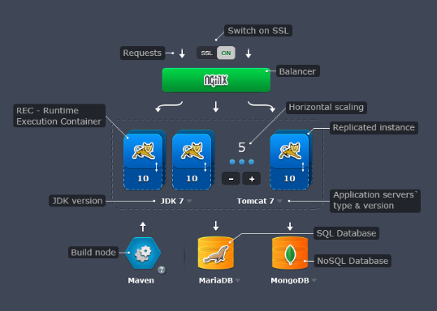

Some days ago I receive an invitation for testing <a href="http://jelastic.com">Jelastic</a>
  product and, today Saturday, I had a while, made my homework and had my first contact with the platform.

<h2>Who is behind Jelastic?</h2>

That was my first question so I took a look to the Jelastic web site.

The best way to answer this is looking at the <a href="http://jelastic.com/team">Jelastic Team</a> section. Founders, advisers, special partners conforms a real professional team. As special partners you will find the MySQL (Michael "Monty" Widenius) and Nginx (Igor Sysoev) authors.

Special mention too to their evangelists (not mentioned in the web page). In my case, Judah Johns spent their time writing me two personal emails simply to let me know about the Jelastic platform and the possibility to test it for free. That's a real evangelist ;)

<h2>Registration</h2>

Sign up with the service is really easy. Once sent the registration email you will receive a welcome email with an initial password for log in.

<h2>First impression</h2>

My first impression with Jelastic, from the web page to the service once logged in, was: Ough!!!

I know design is something subjective, what you love other can hate, but the first impression is what counts in a 75%.

Sorry Jelastic but, from my point of view, you need a redesign. That darker theme is absolutely dreadful.

<h2>Environments</h2>

After the first impression I start working in something more functional, which is what really matters for a developer.

An environment is a concrete configuration of servers for load balancing, application logic and storage.

Load Balancing is achieved with Nginx server.

Application logic is implemented as a Java server side application and can run on Tomcat6, Tomcat7, Jetty6 or GlasFish3 servers using JDK6 or JDK7.

For storage we can use SQL or NoSQL solutions. For SQL we have the most known open source projects: PostgreSQL 8.4, MySQL 5.5 and MariaDB 5.2. For NoSQL we can use MongoDB 2.0 or CouchDB 1.1.

Creating a new environment is incredible easy. We can choose to use a load balancer or not, define the number of application logic server instances, possibility of high availability (which means <a href="http://jelastic.com/docs/session-replication">session replication</a>) and the storage service.

Once created, the environment's topology can be modified at any time. At practice this means you can scale your application adding more application server instances or applying the high availability options, which allows to replicate the sessions. In addition you can change or add a new store services.

<blockquote>
<strong>Note</strong>: Be aware if you change your relational or NoSQL server because data lost.
</blockquote>
<h2>Deploying applications</h2>

For testing purposes, Jelastic comes with a <em>HelloWorld.war</em> sample applications. Deploy it is as easy as selecting and deploying on one of your, previously created and configured, environments.

To deploy your own application you need to upload it first. After uploaded your application will be shown in the applications list and you could deploy like previously commented.

<h2>Server configuration</h2>

Once created the environment, you have access to the configuration files of your servers.

I played a bit with a simple Tomcat+MySQL configuration and see you:

<ul>
<li>have access to modify files like <em>web.xml</em> or <em>server.xml</em></li>
<li>can change logging preferences</li>
<li>can upload new JAR files to or remove them from the <em>lib</em> folder</li>
<li>have access to the <em>webapps</em> folder</li>
<li>have a shortened version of <em>my.cnf</em> file you can edit.</li>
</ul>
<h2>Log files and monitoring</h2>

Jelastic monitors the servers of your environments and presents the results in a nice graphical way.

In addition it also allows to see the log files of the servers:

Looking log files in the browser is something funny, but <strong>I would like a way (I didn't find it) to download the log files to my local machine</strong>. Looking for errors in a production environments with tons of lines isn't easy to do in that text area.

<h2 style="text-align: left;">Resources</h2>

Connect your application to the storage service (relational or NoSQL database) is really easy. The <a href="http://jelastic.com/docs/general-information">documentation</a> contains samples for all the databases the Jelastic has support.

The application logic servers have access to a home directory where you can create property files or upload whatever you want your application can use later using:

<pre class="brush:java">System.getProperty("user.home")</pre>
<h2>Conclusions</h2>

At the opposite of Amazon AWS, Google App Engine or others, Jealastic is completely oriented to Java.

If you are a Java developer and ever worked with AWS or Google App Engine you will find Jelastic complete different and incredible easy to use, really similar as a usual day to day work.

While AWS is <em>machine oriented</em>, where you start as many EC2 instance as you require, with Jelastic you have the concept of <strong>cloudlet</strong> and you can forget completely to manage machine instances and their resources.

<blockquote>
Note: <strong></strong>A cloudlet is roughly equivalent to 128 MB RAM and 200Mhz CPU core.
</blockquote>

I have written this post before dinner so, as you can see, it is nothing exhaustive but a simple platform presentation.

A great continuation would require to explain the experiences working with a real application, deploying operations and tweaking the running environment to achieve good performance with lowest cloudlet consume.

If someone is interested, another great article could compare the cost of the same application running with Amazon AWS and Jelastic: where runs with better performance and which one is cheaper.

