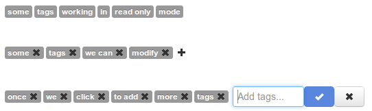

<a href="http://jquery.com/">jQuery</a> is widely used in the web world. Since its creation it was quickly adopted by many programmers mainly due its easily of us and extension capabilities.

I used jQuery in many projects and for many different things, thanks to the legion of existing plugins I always found a solution to my issues... since today.

I was looking for plugins to manage tags. Of course I found many alternatives but no one likes me. Some of them lake from desired methods, others was based on additional libraries (like <a href="http://jqueryui.com/">jQueryUI</a>) where I want a more simple solution, some others was too complex to change its style or, other times, simply I found its code them too much complex for something I consider more simple to do.

<h2>The problem</h2>

I was developing a web site using <a href="http://twitter.github.com/bootstrap">Twitter Bootstrap</a> framework and I needed a jQuery plugin to manage tags. The requirement was the plugin has a look and feel based on the Bootstrap components: labels, icons, buttons, etc

After looking for a couple of days, testing some plugins and looking on its source code I realize neither of them likes me, so I start developing my custom alternative.

<h2>The <em>tagger</em> plugin</h2>

In a boast of originality I called the plugin <em>tagger</em> and it can works in two modes (read or write mode) depending on if you want to simply show some tags or you want to change the tags list adding or removing.

To remove a tag you can simply click the remove icon on each tag and to add new tags you must click the plus sign. This makes a little form opens with an input text element where you can write the desired tags to add to the list.

<h2>Documentation</h2>

I have prepared a special web page that acts as <a href="http://www.acuriousanimal.com/tagger.js/">documentation page</a> and shows the plugin in action.

<h2>Source Code</h2>

This weekend project is open and free, so feel free to contribute with new features and improvements. You can find at my GitHub repository <a href="https://github.com/acanimal/tagger.js">tagger</a>.

