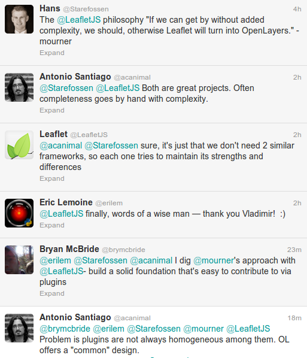

I wrote this post some months ago, before I publish the OpenLayers Cookbook, but I never published it thinking it could start a flame war instead a constructive thread.

Today, after a twitter conversation (thanks <a href="http://twitter.com/Starefossen">@Starefossen</a>
  <a href="http://twitter.com/brymcbride">@brymcbride</a>
  <a href="http://twitter.com/erilem">@erilem</a>
  <a href="http://twitter.com/mourner">@mourner</a> and
  <a href="http://twitter.com/LeafletJS">@LeafletJS</a>) I think it is time to publish it.

<h2>OpenLayers</h2>

OpenLayers is a great project. I think it is the most complete GIS project for creating web mapping applications. Its completeness makes it also a bit complex, but a complexity that is necessary.

OpenLayers allows to use raster and vector layers. Respect vector layers we can load data from different data sources (files, WFS servers, ...) and with different formats (GML, GeoJSON, KML, ...). OpenLayers allows to render geometries using different technologies (SVG or Canvas) in a way transparent to the user. Its design tries to follow as close as possible the standard concepts of features, geometries, attributes and tries to implement most of them (WMS, WFS, SLD, ...).

In summary, OpenLayers tries to offer all the things a complete GIS project could need. Its desing has made having all this in mind and results in a big and complex architecture but, take into account, which is necessary to give response to all the requirements.

<h2>Leaflet</h2>

On the other hand we found a project like Leaflet, designed from the beginning with a philosophy close to  "<em>make it without complexity</em>" or "<em>offer only that things required to create a simple maps</em>".

Leaflet offers raster layers (from a tiled source), vector layers, markers and popups and, every day, a growing set of plugins adding more features to it: read GeoJSON files, clustering strategy, etc.

Leaflet is much more lightweight and, to create a simple map, it is more simple to use.

<h2>The secret behind the fame of Leaflet</h2>

IMO Leaflet has two main aspects that has made it the perfect option to be used in thousands of web pages: its <em>look and feel</em> and its <em>coding style</em>.

The Leaflet L&amp;F is better than OpenLayers: buttons and layer switcher (among others) looks like an actual and fresh project instead like an almost 10 years old project like OpenLayers.

The Leaflet coding style is actual. The use of short namespaces and the chaining functions style (something like jQuery) makes it feel like a modern project and, probably, easier to use than OpenLayers.

<h2>What about Leaflet plugins?</h2>

Many of you can think "<em>what about the plugins?</em>" It is known one of the key aspects of Leaflet is the fact it offers a base code on which develop other plugins to make the platform better and greater. Yes, that is nice but is not always true.

For me, the growing set of Leaflet plugins remember the myriad of jQuery plugins. Most of them are great, awesome, but not all of them follow the same rules. Every developer can create plugins without a common design or architecture integration.

For example, the <a href="https://github.com/Leaflet/Leaflet.markercluster">Leaflet.markercluster</a> plugin (from Dave Leaver <a href="https://twitter.com/daveleaver">@daveleaver</a>) is an awesome plugin that allows to make the same as the cluster strategy on OpenLayers, that is, group "points" which are too close and can overlap each other.

<blockquote>
I must to say I start coding the <a href="//2012/09/06/animatedcluster-demo-site-updated-to-work-with-openlayers-2-12">AnimatedCluster strategy</a> for OpenLayers after seen the Dave's work, which I consider superior to mine.
</blockquote>

The Leaflet.markercluster version is based in the concept of markers while the AnimatedCluster follow the more standard concept of <em>feature</em>.

To style markers in the Leaflet.markercluster you need to implement a <code>iconCreateFunction</code> and pass to the constructor which must be responsible to set the CSS style for each marker depending on the number of points it clusters (see the <a href="http://leaflet.github.io/Leaflet.markercluster/dist/leaflet.markercluster-src.js"><code>_defaultIconCreateFunction</code></a> as a sample).

In the AnimatedCluster we have all the power of the features, geometries and styles OpenLayers offers us. We can create a vector layer, assign the AnimatedCluster strategy to it with some rules to style and automatically our layer will act as a cluster layer (please read the post <a title="Animated marker cluster strategy for OpenLayers" href="//2012/08/19/animated-marker-cluster-strategy-for-openlayers">Animated marker cluster Strategy for OpenLayers</a> for more detailed explanation).

The fact OpenLayers is designed with many requirements in mind allow to work with a set of well designed pieces, like vector layers, features, geometries, styles, protocols and formats. But in contrast it adds some rigidness to implement new features that must conform the "global" rules.

On the other hand, Leafet lacks from a "global" design and, because of this, two similar plugins can follow to different implementation without the option of "reuse concepts" (think in another plugins that styles markers). But this lack of "global design" is what makes Leaflet be more flexible than OpenLayers.

<h2>Conclusions</h2>

IMO, both OpenLayers and Leaflet are great tools for different (but also similar) purposes. I consider Leaflet ideal for web pages with relatively simple maps (to create great visualizations with markers, popups, etc) but for a more GIS oriented solution I have no doubt of using OpenLayers.

Having that in mind it is easy to see there are a bigger number of sites requiring something like Leaflet instead of OpenLayers. The 90% of users requires a "simple map solution" instead a GIS solution. Having that in mind it is easy to see we are comparing a "simple map solution" with a GIS solution and I ask you: why?

As developer we have the pleasure to have two great tools on our bag. It is our responsibility to use the appropriate one on each situation.

