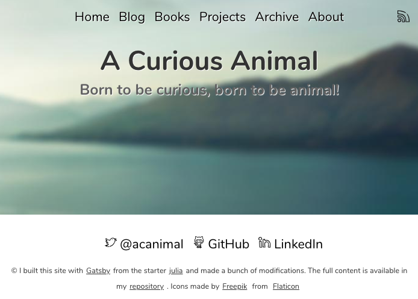

I think it was a matter of time to make this change. [Jekyll](https://jekyllrb.com/) was one of the first static site generates and it's awesome but for me, as a JavaScript developer that know little about ruby language, has more sense to stay close JS world.

I heard about [Gatsby](https://www.gatsbyjs.org/) some time ago but never spent enough time to get a good ideas about its philosophy and capabilities. Finally this weekend I decided to make the change. What I found is while Jekyll is extremely good doing one thing --mainly focused on blogs--, Gatsby is a more general solution that can be good for many other things and not only a blog.

This post is about my experience in the migration process and how I implemented some features.

<!--more-->

## Differences between Jekyll & Gatsby

> Disclaimer: I'm not a Jekyll expert so don't flame 🔥 next is my description of Jekyll for a blogger user

Jekyll is mainly focused on static sites like blogs, because of this it divides the type of content between `pages` and `posts`. If you write a markdown file in the root folder or under `_site` thay are considered pages, meanwhile if you write `.md` files in `_posts` folder they are considered posts.

In addition the post files must be named following the next rule `YEAR-MONTH-DAY-title.md` i.e. `2012-09-12-how-to-write-a-blog.md`. This is a nice rule that make your post files appears ordered in disk.

Both pages and posts have a main section so called *frontmatter* used to specified some attributes of the content like title, date, tags, ...:

```
---
layout: post
title:  "Welcome to Jekyll!"
---
```

On the other hand Gatsby is a more general purpose tool that reads data from different sources, process them and generate pages and the great is what it reads, process and generates is up to you. 

Well, don't worry most of them are done automatically but you are allowed to be involved in the previous process and tune them to achieve what you need.

Note, one really important difference between Jekyll and Gatsby is designed to work with markdown content by default, both pages and posts can directly be written in markdown format, while Gatsby understand JavaScrip and React, but anyway it is easy configurable to accept other data sources like markdown files.

## Before start

I hate those shitty posts title `Migrating from X to Y in 10 minutes` so `How to build X in 20 min`, so to be honest I want to say it clear: I spent many ours last weekend migrating my site from Jekyll to Gatsby, and that includes some hours playing with Gatsby, learning its API, looking into others source code and existent staters.

Further more, I'm not a great designer. I love programming the client side but after years I have finally admitted to myself I'm not able to do visual beautiful things 😅 so I spend some time looking for a theme for my site and finally decided for the one used in the [julia](https://www.gatsbyjs.org/starters/niklasmtj/gatsby-starter-julia/) starter.

> One thing a loved about this theme is it used the [emotion](https://emotion.sh/docs/styled) library for CSS styles.

One important consideration in my migration is all the content from previous site made in Jekyll is written in markdown, so I don't want to rewrite everything as JavaScript, React and HTML, the goal is simply copy&paste all those file and make them work in the new Gatsby site.

## How Gatsby works

I'm going to try to synthesize the content of the [Gastby Internal](https://www.gatsbyjs.org/docs/gatsby-internals/) section in a few senteces:

> The flow to build a Gatsby site is as follow:
> - first read data sources: this can be the JS files in the `src/pages` or any file read by a plugin like `gatsby-source-filesystem`. All this content is transformed into *gastby nodes*. For example, each markdown file es read and converted into a node.
> - process the previous *gatsby node*: as example, here we can create and attach new properties to the node. For example here we compute a slug for each node that corresponds to a blog post.
> - create pages: we tell Gatsby engine to create a page for the nodes we desire. For example, we create a page for each blog posts, or a page for each node that correspond to a markdown *marked* as *page*,

## Analyzing the new site

After the selecting the theme for the new site I was thinking how to organize it by sections:

- Home: Simple landing page with slogan and some links to my social networks
- Blog: This should contain all my previous posts written in markdown
- Books, Projects and About: those sections are also written in markdown
- Archive: This was automatically generated in Jekyll and must also by automatically generated in Gatsby



So at the end I have: 
- sections written natively in JavaScript and sections written in markdown
- sections that are pages and blog posts

Write pages in Gatsby is really easy, by default all React components under `src/pages` will be transformed to a page.

## Migrating the markdown pages

- Pages and pages in md format

## Migrating posts

- Talk about slug
- POagination

## Updating excerpt

## Added time to read
